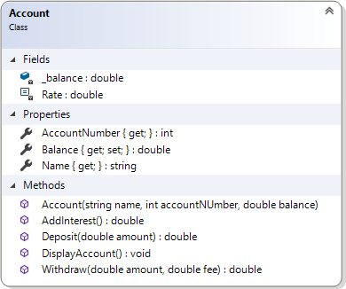

# Tröstrika banken

- [GitBook](https://coursepress.gitbook.io/1dv024/ovningsuppgifter/del-2/trostrika-banken)
- [Lösningsförslag](https://github.com/1dv024/exercise-solution-proposals/tree/master/exercise-consoling-bank)

Till denna övningsuppgift medföljer ett projekt där en klass, `Account`, saknas. Klassen `Program` och dess `Main`-metod finns redan definierad. Din uppgift är att skriva en klassdeklaration för den saknade klassen, så att koden i `Main` kan köras utan problem och ger en utskrift enligt bilden nedan.

```Sparkap Ital försöker sätta in en summa mindre än 0.
The amount can not be less than 0.
15672	Sparkap Ital	2.559,37 kr

Sparkap Ital sätter in pengar.
15672	Sparkap Ital	3.000,87 kr

Sparkap Ital tar ut pengar.
15672	Sparkap Ital	1.997,37 kr

Fatti Glapp försöker ta ut 10000 kr.
Manage your account wisely so you do not overdraw.
78153	Fatti Glapp	17,12 kr

Ränta sätts in

Alla konton
15672	Sparkap Ital	2.067,28 kr
78153	Fatti Glapp	17,72 kr
93781	Massap Engar	16.424.866,24 kr</pre>
```

<figcaption>
Figur 1. Utskrift efter att klassen <code>Account</code> har implementerats korrekt.
</figcaption>

Du får inte redigera koden i klassen `Program` på något sätt. All kod du skriver ska skrivas i klassdeklarationen till klassen `Account`. Genom att analysera figur 1, klassdiagrammet och metoden `Main` ska du komma fram till hur klassen ska implementeras.

## Klassen `Account`

Klassen representerar ett enkelt bankkonto. Klassen innehåller fält som representerar bankkontots ägare, nummer och saldo. Räntan lagras i en symbolisk konstant, `Rate` (som du ger värdet 3,5 % eller snarare värdet 0.035).

<figure>

<figcaption>
Figur 2. Klassen <code>Account</code>.
</figcaption>
</figure>

### Fält (Fields)

Klassen `Account` har en konstruktor som tar tre parametrar, vilka används till att initiera ett nytt objekt då det instansieras av klassen.

### Egenskaper (Properties)

De båda egenskaperna `AccountNumber` och `Name` tillhandahåller enbart en publik `get`-metod vardera. Egenskapen `Balance`, som både har en `get`- och en `set`-metod, är kopplad till fältet `_balance` men det är bara `get`-metoden som ska vara publik; `set`-metoden ska vara privat.

### Metoder (Methods)

Klassens övriga metoder är publika och används för att göra olika saker som att sätta in och ta ut pengar. Innan en metod får modifiera saldot (`_balance`) måste den undersöka datat som skickas in till metoden så att en transaktion kan utföras korrekt. Exempelvis måste metoden `Withdraw()` hindra alla försök till ett negativt uttag (som ju då skulle bli en insättning).

#### AddInterest

Du anropar `AddInterest()` för att lägga till ränta till bankkontot. Multiplicera saldot med räntan och addera resultatet av multiplikationen (produkten) till saldot.

#### Deposit

För att sätta in pengar på kontot anropar du metoden `Deposit()`. Du måste kontrollera att beloppet som ska sättas in verkligen är större än 0. Är det inte större än 0 kastar du ett undantag med meddelandet _"The amount can not be less than 0."_.

#### DisplayAccount

Då du vill presentera ett bankkonto anropar du metoden `DisplayAccount()`. Bankkontonummer, innehavarens namn samt saldot ska presenteras. Använd tabbtecken (`\t`) för att separera de olika värdena åt. För att presentera ett tal som en valuta använder du dig av formatspecificeraren `c`, t.ex. `{0:c}`.

#### Withdraw

För att ta ut pengar från bankkontot anropar du metoden `Withdraw()`. Du måste förvissa dig om att det finns pengar på kontot så att de räcker både till uttaget och till avgiften för uttaget innan uttaget genomförs. Saknas pengar kastar du ett undantag med meddelandet _"Manage your account wisely so you do not overdraw."_.

### Main.cs

```c#
static void Main()
{
    Account account1 = new Account("Sparkap Ital", 15672, 2559.37);
    Account account2 = new Account("Fatti Glapp", 78153, 17.12);
    Account account3 = new Account("Massap Engar", 93781, 15869435.98);

    Console.WriteLine($"{account1.Name} försöker sätta in en summa mindre än 0.");
    try
    {
        account1.Deposit(-100);
    }
    catch (Exception ex)
    {
        Console.WriteLine(ex.Message);
    }
    account1.DisplayAccount();
    
    Console.WriteLine($"\n{account1.Name} sätter in pengar.");
    account1.Deposit(441.50);
    account1.DisplayAccount();
    
    Console.WriteLine($"\n{account1.Name} tar ut pengar.");
    account1.Withdraw(980, 23.5);
    account1.DisplayAccount();
    
    Console.WriteLine($"\n{account2.Name} försöker ta ut 10000 kr.");
    try
    {
        account2.Withdraw(10000, 23.5);
    }
    catch (Exception ex)
    {
        Console.WriteLine(ex.Message);
    }
    account2.DisplayAccount();
    
    Console.WriteLine("\nRänta sätts in");
    account1.AddInterest();
    account2.AddInterest();
    account3.AddInterest();
    
    Console.WriteLine("\nAlla konton");
    account1.DisplayAccount();
    account2.DisplayAccount();
    account3.DisplayAccount();
    Console.WriteLine();
}
```

## Mål

Efter att ha gjort uppgiften ska du kunna:

- Veta hur du skapar objekt och initierar ett objekts fält med hjälp av en konstruktor.
- Känna till att:
    - egenskapers `get`- och `set`-metoder kan vara en mix av `public` och `private`.
    - egenskaper som bara har en `get`-metod kan trots det tilldelas ett värde i konstruktorn (s.k. _immutable property_).
- Kunna använda en privat symbolisk konstant i en klass.

## Tips

Läs om:

- Grunderna om klasser och objekt hittar du i inledningen av kapitel 5, som bl.a. tar upp saker som konstruktorer (_constructors_), accessmodifierare (_access modifiers_), fält (_fields_) och egenskaper (_properties_).
- Konstant som fält i kurslitteraturen, kapitel 5, under rubriken _”Encapsulating the Data”_.
- Grunderna i hur du kastar undantag hittar du i inledningen av kapitel 10.